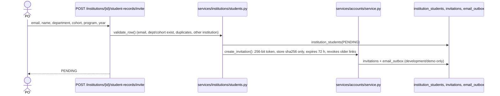
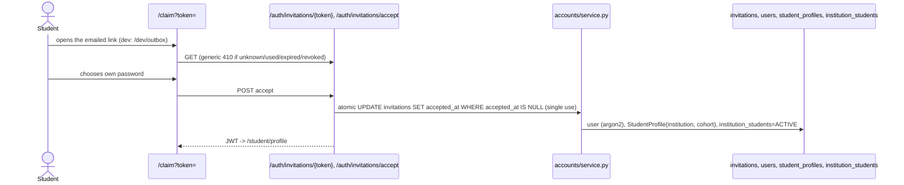

# Full Dataflow (three active roles)

Placement Officer · Company (Recruiter) · Student. Every arrow below is a real route or service in the current code
(paths relative to `backend/app`). "Celery" = a task on the dev Valkey broker; tests use an isolated db 10.

## 1. Placement Officer signup
```mermaid
sequenceDiagram
  actor PO as Placement Officer
  participant FE as SignupPage
  participant API as POST /auth/signup (api/v1/auth.py)
  participant SVC as services/auth + services/accounts
  participant DB as users, institutions, institution_members
  PO->>FE: name, email, password, institution name
  FE->>API: role=PLACEMENT_OFFICER, institution_name
  API->>SVC: signup() (argon2 hash)
  SVC->>DB: INSERT user; provision_placement_officer(): institution + membership(PLACEMENT_OFFICER)
  API-->>FE: JWT -> /institution
```

## 2. Student invitation


## 3. Student CSV import
```mermaid
sequenceDiagram
  actor PO
  participant P as POST .../import/preview
  participant C as POST .../import/confirm
  participant S as students.py
  PO->>P: CSV (<=1 MB, <=1000 rows)
  P->>S: parse + validate every row against the DB (no writes)
  P-->>PO: INVITE / LINK_EXISTING_ACCOUNT / ERROR(line, reason)
  PO->>C: same file
  C->>S: re-validate server-side (preview is never trusted); apply valid rows
  S-->>PO: invited, linked, and every invalid row with its reason
```
Existing STUDENT account with the same email is linked (no duplicate user); a student at another institution is an error row.

## 4. Student account claim

Password reset uses the same pattern (`password_resets`, 60 min, always-202 forgot endpoint).

## 5. Company signup
`POST /auth/signup` with `role=RECRUITER`, `company_name` -> user + `organizations` + `organization_members(COMPANY_ADMIN)`. One primary recruiter per company (no team management).

## 6. Job creation
```mermaid
sequenceDiagram
  actor R as Recruiter
  participant API as /jobs (api/v1/jobs.py)
  participant W as Celery jobs.process
  participant AI as AI gateway (jd_extraction)
  participant DB as jobs, job_skills
  R->>API: POST /jobs (title), PUT /jd (text|file)
  API->>W: POST /jobs/{id}/process
  W->>AI: extract requirements
  W->>DB: job_skills (unconfirmed)
  R->>API: PUT /jobs/{id}/requirements/confirm (map/remove unmapped skills; human gate)
```

## 7. Institution job approval
```mermaid
sequenceDiagram
  actor R as Recruiter
  actor PO as Placement Officer
  participant J as PUT /jobs/{id}/distribution
  participant O as /institutions/{id}/opportunities
  participant DB as jobs (distribution_type, target_institution_id, institution_approval, eligibility)
  R->>J: INSTITUTION + target institution
  Note over DB: publish -> institution_approval=PENDING
  PO->>O: GET ?status=PENDING (JD + skills; never assessment content)
  PO->>O: approve {departments, cohorts, graduation years} | reject {reason}
  O->>DB: APPROVED + eligibility, or REJECTED + note (recruiter sees it)
```

## 8. Student job eligibility (deterministic)
`services/jobs/visibility.py::student_can_access_job`, used by `GET /jobs`, `GET /jobs/{id}` and `POST /applications`:
OPEN_MARKET -> visible. INSTITUTION -> requires `APPROVED`, student's `institution_id` = target, an ACTIVE `institution_students` row, and department / cohort / graduation year in the job's `eligibility` (an empty rule allows all). No model is involved.

## 9. Assessment authoring
```mermaid
sequenceDiagram
  actor R as Recruiter
  participant G as POST /assessments/jobs/{id}/generate (total_questions)
  participant W as Celery assessments.generate
  participant BP as blueprint.py (deterministic, ~40% MCQ)
  participant AG as assessment_agent (+ generator, validator)
  participant J0 as Judge0
  participant DB as assessments, questions
  R->>G: target size
  G->>W: task
  W->>BP: slots per skill/type
  W->>AG: fill from company/platform bank, else generate (<=3 attempts per slot, failure reasons fed back)
  AG->>J0: coding: reference solution runs on every test; disagreeing tests dropped; >=8 tests, >=2 samples, >=4 categories
  R->>R: PUT /assessments/{id}/config (time limit, shuffle), review coverage
  R->>DB: POST /publish -> assessment_versions v1 (frozen content, keys, hidden tests) ; job PUBLISHED; interview pool task queued
```

## 10. Assessment attempt
```mermaid
sequenceDiagram
  actor ST
  participant GATE as ProctoredGate (consent, system check, fullscreen)
  participant API as /assessments
  participant DB as assessment_attempts (version_id, started_at, expires_at, question_order, option_orders)
  ST->>GATE: consent + check -> proctoring session ACTIVE
  ST->>API: POST /{id}/attempts (row lock; get-or-create; timer starts here)
  API->>DB: freeze version, CSPRNG layout, expires_at = started_at + duration
  ST->>API: GET /attempts/{id} (frozen questions, persisted order, server_time, expires_at)
  ST->>API: PUT /answers (autosave, marks; 409 ATTEMPT_EXPIRED past deadline+15 s)
  ST->>API: POST /submit (idempotent; also run by GET after the deadline)
```

## 11. MCQ scoring
`_finalize` compares the answer's ORIGINAL option index (client sends the displayed index, `to_original`) with the frozen key: deterministic, `record_evidence(MCQ, confidence 0.6)`. No model.

## 12. Coding
```mermaid
sequenceDiagram
  actor ST
  participant RUN as POST /coding/run
  participant SUB as POST /coding/submit
  participant J0 as Judge0 (Python 71, Node 102, C++17 105)
  ST->>RUN: code (+ optional custom input)
  RUN->>J0: visible samples only (+ custom stdin); rate-limited; no submission, no evidence
  ST->>SUB: code
  SUB->>J0: ALL tests (visible+hidden), up to 4 concurrent
  SUB-->>ST: status only (ALL_TESTS_PASSED | SOME_TESTS_FAILED | COMPILE_OR_RUNTIME_ERROR); coding_test_results kept for reviewers
```

## 13. Technical (written) response
Autosaved -> at submit, scored concurrently (<=4) against the frozen rubric (`evaluate_rubric`, task `rubric_evaluation`) -> `assessment_answers.rubric_evaluation` -> `record_evidence(TECHNICAL_ASSESSMENT)`.

## 14. AI interview
```mermaid
sequenceDiagram
  actor ST
  participant PREP as POST /interviews/prepare + GET /readiness (during system check)
  participant POOL as interview_templates / interview_pool_questions
  participant N as POST /interviews/{id}/next-turn
  participant A as POST /interviews/turns/{id}/answer
  participant SEL as selector.py (importance x uncertainty x required x prerequisite)
  ST->>PREP: ready when pool READY (authoring task filled it at publish)
  ST->>N: Start -> select_from_pool (DB lookup, ~10 ms) -> question 1 (text + browser speech)
  ST->>A: answer: committed first, scored (budget 2.5 s), evidence, or finishes in background
  A->>SEL: next competency + difficulty from evidence known so far
  ST->>N: auto-advance (catch-up <=1 s), pool question; live agent only if the pool cannot serve
```

## 15. Evidence calculation
`services/evidence/service.record_evidence` (append-only, idempotent keys) -> `estimator.recalculate_all_skills_for_student` (`skill_scoring_v1`, deterministic) -> `student_skills`. Resume claims count 0.

## 16. Match calculation
`services/matching/engine.compute_match_for_application` (`matching_v1`): required/preferred fit, evidence confidence, semantic relevance; deterministic, no LLM; runs when the interview completes and on demand.

## 17. Placement Officer analytics
`GET /institutions/{id}/overview` and `/analytics` (`services/analytics/institution.py`): every number is a SQL aggregate over `institution_students`, `student_profiles`, `assessment_attempts`, `interviews`, `applications`, `matches`. The optional LLM summary only words those figures.

## 18. Recruiter decision and notifications
`PUT /applications/{id}/status` (recruiter roles, own organization) -> `transition_application` (validated state machine, `application_status_history`, audit) -> `notify()` rows (`notifications`, deduplicated). Students see the resulting status and qualitative feedback only.
